# TowerDefense-GameFramework-Demo（MyTestGame）

## 简介

这是一款基于开源框架 [GameFramework][1]（以下简称 GF）实现的塔防游戏 Demo。Demo 原型是 Unity 官方放在 Asset Store 上的 Demo [Tower Defense Template][2]。此项目是对 Demo 原型使用 GF 进行再实现以及扩展，主要用于个人对 GF 的学习和实践，也给其他学习 GF 的同学一个参考。

本仓库（`miniGame`）在原始 Demo 基础上继续二次开发：把 Unity 版本升级到了 **Unity 6**，接入了 **Spine** 骨骼动画，并补充了一批新的美术资源。Unity 工程位于仓库的 `MyTestGame/` 目录下。

## 版本信息

| 项 | 版本 / 说明 |
| :--- | :--- |
| Unity | **6000.3.25f1（Unity 6）**，工程已完成升级（原 README 记录为 2019.4.1f1） |
| GameFramework | 沿用原 README 记录的 2020.12.31，源码内嵌于 `Assets/GameFramework`，随工程一起版本管理 |
| spine-unity Runtime | 4.1.43（`spine-unity-4.1-2024-06-19`），位于 `Assets/Spine` |
| Tower Defense Template | 1.4（原始原型版本，沿用原 README 记录） |
| 仓库 / 工程 | 仓库 `miniGame`，Unity 工程位于 `MyTestGame/` |
| 代码规模 | 901 个 `.cs` 文件（GameMain 105 / GameFramework 646 / Spine 149） |

## 框架代码解析

这里是 GF 代码分析的专栏：[GameFramework解析：开篇](https://zhuanlan.zhihu.com/p/426136370)

## 工程结构

```text
MyTestGame/
├── Assets/
│   ├── GameFramework/          # GF 框架源码与 Unity 接入层
│   │   ├── Libraries/          # 框架核心（347 个 .cs）+ ICSharpCode.SharpZipLib
│   │   ├── Scripts/            # UnityGameFramework 的 Runtime / Editor 扩展
│   │   └── Prefabs/            # GameFramework.prefab（框架启动预制体）
│   ├── GameMain/               # 游戏业务与资源
│   │   ├── Scripts/            # Base / Procedure / UI / Data / DataTable / Event / Enum ...
│   │   ├── DataTables/         # 19 张数据表（Excel 导出的 .bytes，附同名 .txt 便于查看）
│   │   ├── Configs/            # BuildInfo、BuildSettings、ResourceCollection/Builder/Editor 等
│   │   ├── Entity/             # 6 种塔 + 敌人 + 特效预制体
│   │   ├── Item/               # 放置格子预制体
│   │   ├── UI/UIForms/         # 11 个界面预制体
│   │   ├── Localization/       # 简体中文 / 繁体中文 / 英文
│   │   ├── Sounds/ Res/        # 音频、模型、材质、粒子、场景资源、UI 图集
│   │   └── Scenes/             # GameStart、Menu、Level1 ~ Level5
│   ├── MyResCapity/            # 新增美术资源：Spine 骨骼 + 序列帧（约 3GB）
│   │   ├── json/characters/    # 129 套角色骨骼
│   │   ├── json/ui/            # 61 套 UI 骨骼
│   │   └── C1827_序列帧/        # 190 组序列帧
│   ├── Spine/                  # spine-unity 4.1 运行时（Runtime / Editor）
│   ├── Editor/                 # 工程级编辑器脚本（MCPForUnityToolsMenu 等）
│   └── Resources/              # BillingMode.json（Unity IAP）
├── Packages/                   # manifest.json、packages-lock.json
├── ProjectSettings/
└── Doc/                        # 本文档使用的配图
```

游戏启动流程（`Assets/GameMain/Scripts/Procedure`）：
`ProcedureSplash → ProcedureInitResources → ProcedureCheckVersion → ProcedureUpdateVersion → ProcedureUpdateResources → ProcedureCheckResources → ProcedurePreload → ProcedureMenu → ProcedureChangeScene`

## 游戏简介

### 游戏预览

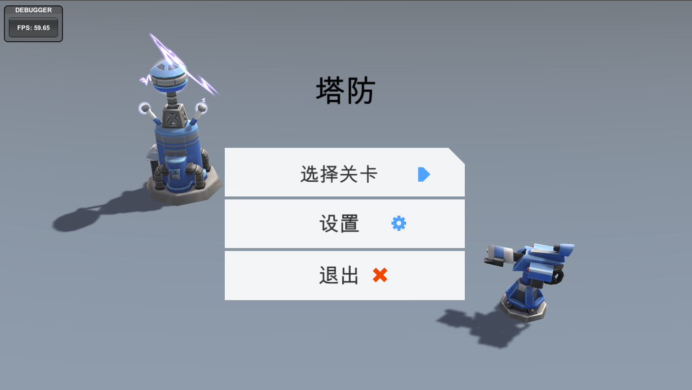  
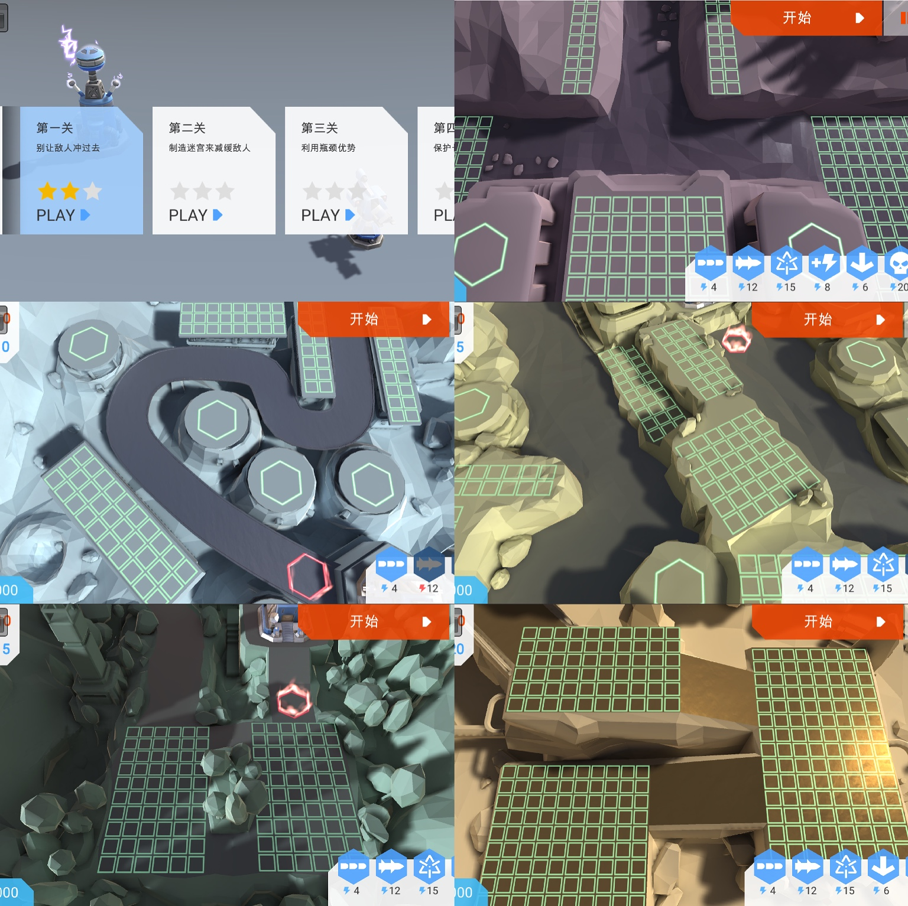  
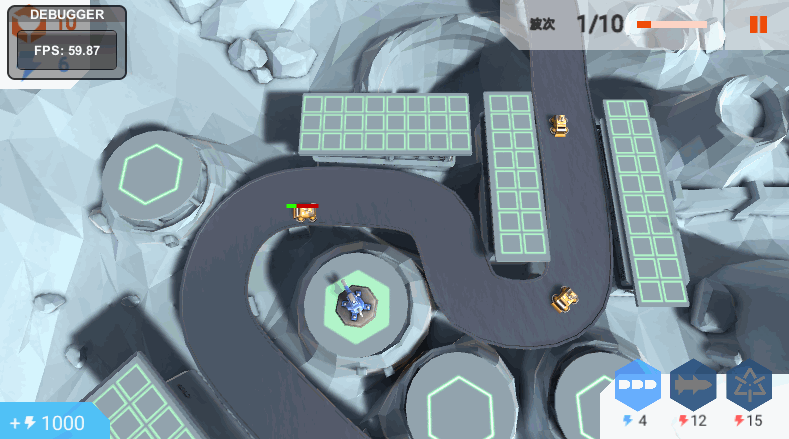  
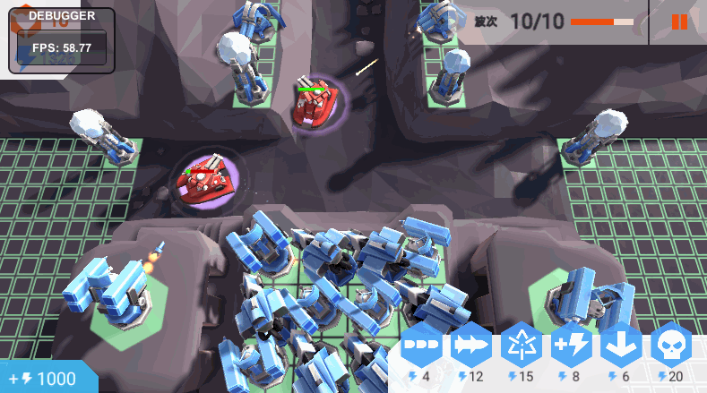

### 游戏介绍

游戏是塔防类型，总共五个关卡，每个关卡的地形环境、产生的敌人、以及可使用的塔都不一样。玩家利用获得的能量根据具体情况选择合适的塔，并建造在适当的位置来阻止敌人攻击基地。

#### 关卡

| 关卡 | 初始能量 | 可用炮塔 |
| :--- | ---: | :--- |
| 第一关 | 10 | 突击加农炮、火箭、等离子喷枪 |
| 第二关 | 15 | 突击加农炮、火箭、等离子喷枪、电磁脉冲发生器 |
| 第三关 | 20 | 突击加农炮、火箭、等离子喷枪、电磁脉冲发生器、导弹阵列 |
| 第四关 | 15 | 突击加农炮、火箭、等离子喷枪、导弹阵列 |
| 第五关 | 20 | 全部 6 种炮塔 |

#### 能量

玩家在关卡开始有少量初始能量，通过击杀敌人和建造能量塔均可以获得能量，能量用于建造和升级塔。

#### 塔

| Id | 名称 | 数据表配置名 | 特点 |
| ---: | :--- | :--- | :--- |
| 101 | 突击加农炮 | Assault Cannon | 高射速、低伤害（Hitscan） |
| 102 | 火箭 | Rocket Platform | 高 AOE 伤害（仅攻击地面敌人） |
| 103 | 等离子喷枪 | Plasma Lance | 低射速、高伤害、远射程 |
| 104 | 能量塔 | Energy Pylon | 每隔一段时间产生能量 |
| 105 | 电磁脉冲发生器 | EMP Generator | 对附近的敌人附加减速效果 |
| 106 | 导弹阵列 | Missile Array | 对大范围敌人造成高额伤害，在场上存在 10 秒钟后自我销毁，可同时攻击多个敌人 |

**塔可以进行升级，升级后可提升射程、伤害、减速率、能量产生效率等**（数据表中除导弹阵列只有 1 级外，其余炮塔各有 3 级）。

#### 敌人

| Id | 名称 | 数据表配置名 | 血量 | 移速 | 击杀获得能量 | 备注 |
| ---: | :--- | :--- | ---: | ---: | ---: | :--- |
| 101 | 虫子 | Buggy | 4 | 4.8 | 1 | 低血量、高移速 |
| 102 | 直升机 | Copter | 16 | 3 | 3 | 飞行单位，可越过炮塔，不受火箭攻击 |
| 103 | 坦克 | Tank | 35 | 2 | 4 | 高血量、低移速 |
| 104 | 首领 | BOSS | 600 | 1.2 | 8 | 超高血量、超低移速 |
| 105 | 超级虫子 | SuperBuggy | 14 | 4.8 | 2 | 高血量版虫子 |
| 106 | 超级直升机 | SuperCopter | 32 | 3 | 4 | 高血量版直升机 |
| 107 | 超级坦克 | SuperTank | 100 | 2 | 4 | 高血量版坦克 |
| 108 | 超级首领 | SuperBOSS | 1400 | 1.2 | 16 | 高血量版首领 |

**敌人一般不会攻击塔，但在塔完全阻挡住敌人前进的路时，就会攻击塔（直升机敌人不攻击塔，会直接越过塔），正确方式是结合地形情况建塔制造迂回路线，增加敌人达到基地需要行走的路程，但又不完全阻挡道路，避免塔被攻击。**

#### 基地

基地是敌人进攻的最终目标，也是玩家需要守护的目标，当基地血量为 0 时游戏失败。

#### 关卡结算

若玩家在消灭关卡所有敌人且基地血量不为 0 时，则通关成功，若在消灭所有怪物前，基地血量被攻击至 0，则游戏失败。通关成功会根据基地剩余血量进行评分。

## 相关实现

本项目用到了 GF 中的多个模块，包括全局配置、数据表、实体、事件、文件系统、有限状态机、本地化、对象池、引用池、流程、资源、场景、游戏配置、声音、UI 等。

### 数据配置

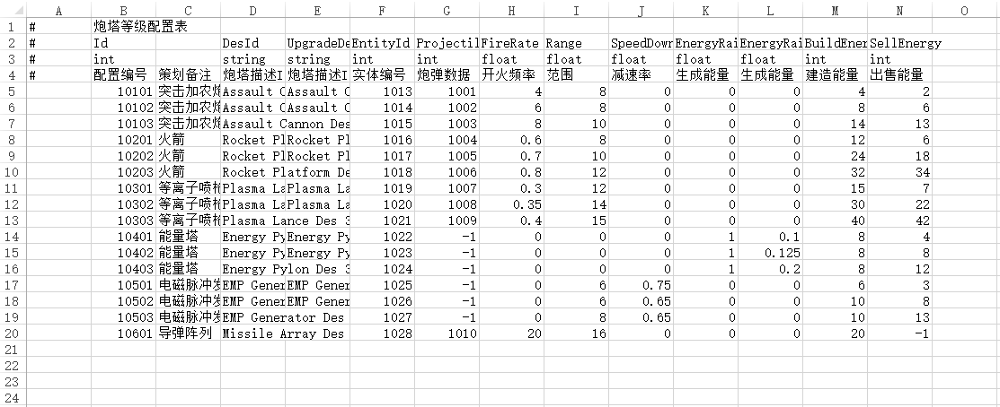  
游戏内所有数据均以 Excel 形式进行配置，导出生成二进制文件后在运行时加载读取。数据表的生成代码位于 `Assets/GameMain/Scripts/Editor/DataTableGenerator`，导出的表位于 `Assets/GameMain/DataTables`（当前 19 张）。

### 本地化

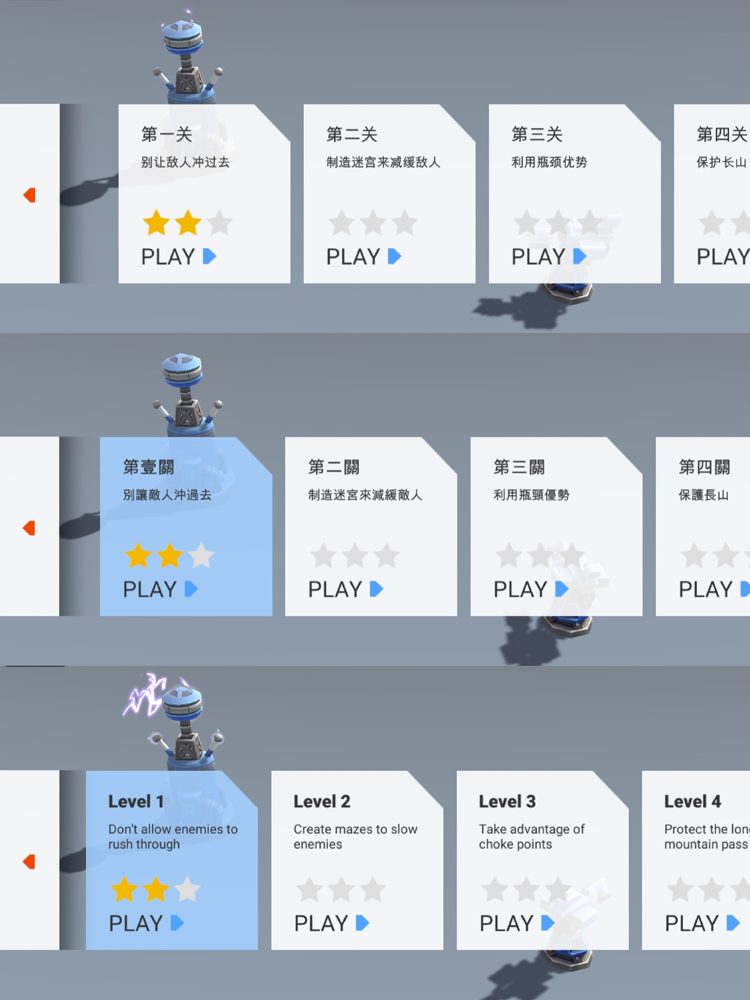  
利用本地化模块以及资源模块中的变体实现游戏本地化，字典由 `Assets/GameMain/Scripts/Editor/LocalizationDictonaryGenerator` 从 `Assets/GameMain/Localization` 下的 JSON 生成。

### 引用池

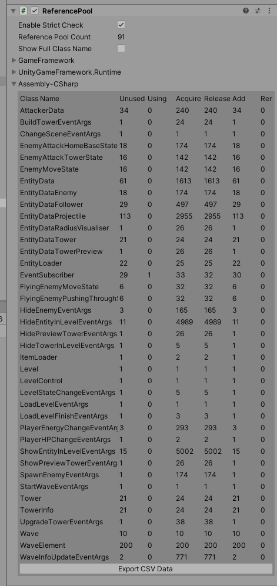  
项目中大量重复使用的对象都使用了引用池进行缓存，避免频繁的内存分配。

### Spine 骨骼动画

新增 [spine-unity][15] 4.1 运行时（`Assets/Spine`）与配套美术资源（`Assets/MyResCapity/json`）。目前主菜单界面 `UIMainMenuForm` 已通过 `SkeletonGraphic` 使用角色骨骼 `m10001`，其余骨骼与序列帧资源尚未接入游戏。

### 资源打包配置

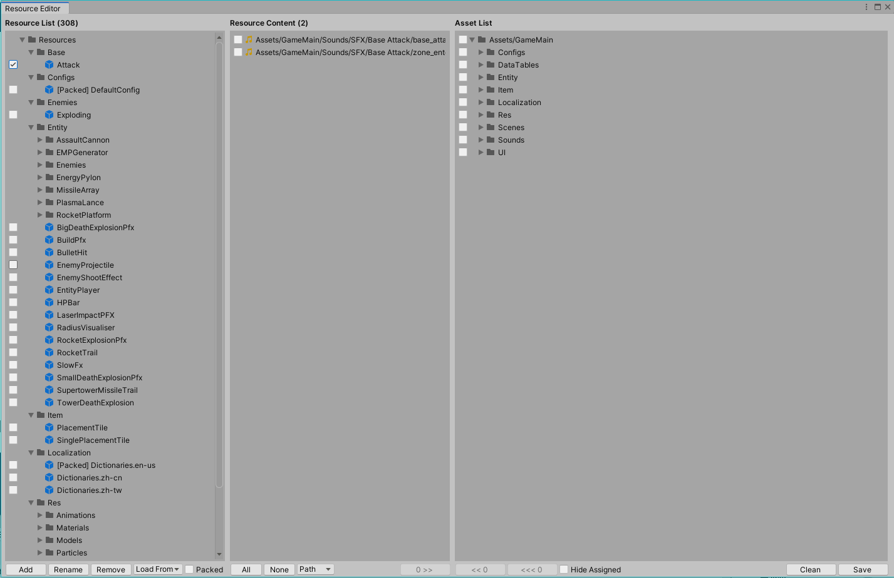
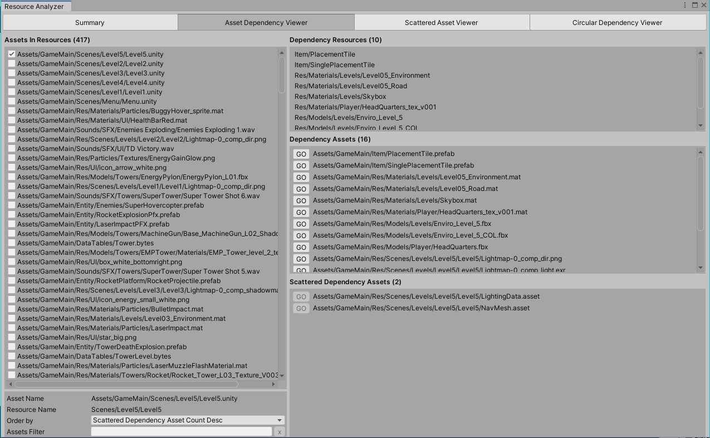  
`Assets/GameMain` 下的资源已完成打包配置，设置了分包信息、文件系统等，并根据内置分析工具做到 0 冗余、0 循环引用。配置见 `Assets/GameMain/Configs` 下的 `ResourceCollection.xml`、`ResourceBuilder.xml`、`ResourceEditor.xml`。

> 注意：新增的 `Assets/MyResCapity`（Spine 骨骼与序列帧）目前还没有纳入上述打包配置。

### 热更新

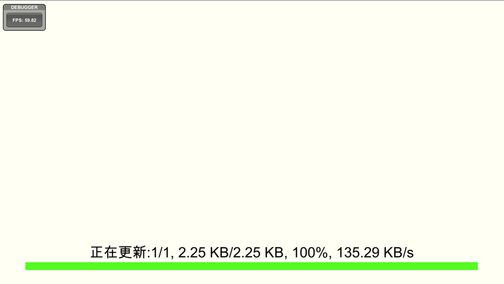  
游戏启动会检测版本信息并进行基本资源（即非关卡内资源）更新，版本地址等配置见 `Assets/GameMain/Configs/BuildInfo.txt`。

### 分包下载

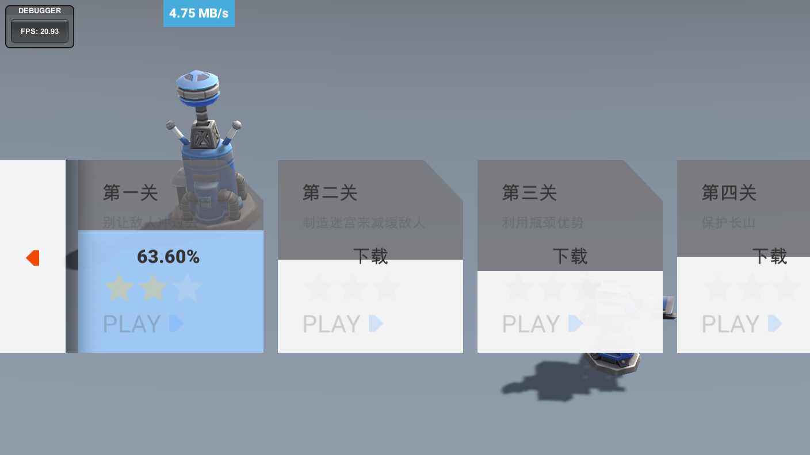  
游戏对每个关卡资源单独进行分包，进入关卡前需要下载更新相应的资源，而暂时没有玩到的关卡可以暂时不下载。

### 编辑器工具与依赖包

- `com.coplaydev.unity-mcp`：Unity 编辑器 MCP 集成，附带菜单脚本 `Assets/Editor/MCPForUnityToolsMenu.cs`。
- `com.unity.purchasing` 5.4.3：内购支持，附带 `Assets/Resources/BillingMode.json`。
- 其他主要包：TextMeshPro 3.0.7、Timeline 1.7.7、Test Framework 1.1.33、AI Navigation 1.1.6、Ads 4.4.2、Analytics 3.8.1。

## 注意事项

游戏在 Editor 下默认以 Editor 模式启动，即读取工程内资源运行，不会读取 AB 包也不会进行更新。项目已正确配置打包信息，并完成了相应的热更逻辑的实现，若要测试更新模式，需要在 Base 组件取消 Editor Resource Mode，并确保 Resource 组件的 Resource Mode 为 Updatable 模式。在打包资源并正确部署资源后即可正常运行更新模式（借助 HFS 等工具可在本地进行部署和测试）。

### Unity 6 升级相关

- 工程从 Unity 2019.4.1f1 升级到 6000.3.25f1 后，Unity 会自动升级各类资源的导入器设置（例如 PNG 的 `.meta` 中 `serializedVersion` 由 10 变为 13），因此升级后会出现大量 `.meta` 文件变更，属正常迁移。
- 为适配 Unity 6，GF 源码做了两处兼容性修改：
  - `ResourceBuilderController`：不再向构建 API 传入已废弃的 `BuildAssetBundleOptions.DeterministicAssetBundle`（该选项在 Unity 5.0+ 已始终生效）。
  - `DebuggerComponent.GraphicsInformationWindow`：`SystemInfo.minConstantBufferOffsetAlignment` 改为 `SystemInfo.constantBufferOffsetAlignment`。
- `Assets/MyResCapity` 体积较大（约 3GB），首次打开工程导入资源耗时较长。
- Spine 运行时遵循 Esoteric Software 的授权条款，Spine Editor 需另行购买。

## 结语

感谢 [GameFramework][1] 作者 [Ellan Jiang][3] 提供的优秀框架；塔防 Demo 的实现与整理见 [TowerDefense-GameFramework-Demo][16]。

  [1]: https://github.com/EllanJiang/GameFramework "GF link"
  [2]: https://assetstore.unity.com/packages/essentials/tutorial-projects/tower-defense-template-107692 "Tower Defense Template Link"
  [3]: https://github.com/EllanJiang "Ellan Jiang link"
  [15]: https://github.com/EsotericSoftware/spine-runtimes "spine-unity link"
  [16]: https://github.com/DrFlower/TowerDefense-GameFramework-Demo "TowerDefense-GameFramework-Demo link"
